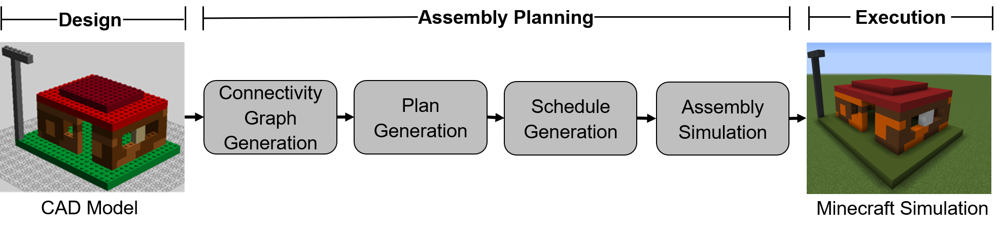

# Assembly Planning Mod
This mod simulates the assembly of LDraw models in Minecraft with string diagrams and is based on the paper [String Diagrams for Assembly Planning](https://arxiv.org/abs/1909.10475). 

The repository contains the source code of the mod which is the last element of the CompositionalPlanning Pipeline:

##  Prerequisites
The mod was developed and tested under Minecraft 1.12.2 (Java Edition) with [Forge 1.12.2-14.23.5.2838](https://files.minecraftforge.net/maven/net/minecraftforge/forge/index_1.12.2.html) (see under all versions for the exact minor version). However, the mod should also comply to the most recent version of Forge and you should be able to build it. Assuming Minecraft and Forge are up and running, "[install](https://www.instructables.com/id/How-to-Install-Mods-for-Minecraft-Forge/)" the mod. The compiled mod can be found under `./documentation` - you just have to copy `compositionalplanning-1.0.jar` to the proper directory (`%appdata%\.minecraft\mods` on Windows).

### Development Prerequisites

If you want to modify this mod, you need to have Forge [set up properly](https://mcforge.readthedocs.io/en/latest/gettingstarted/).
To parse `.graphml` and `.json` we depend on "org.jgrapht:jgrapht-core:1.3.1", "org.jgrapht:jgrapht-io:1.3.1" and "com.google.code.gson:gson:2.8.5", respectively. The dependencies are specified in `build.gradle` and should be automatically resolved.

## Commands
All the actions related to the CompositionalPlanning mod are accessed via the `/assembly ...` command followed by arguments (in Minecraft press <kbd>t</kbd> to open the command prompt).  
Subsequently all the commands are listed and described:

` \assembly columns` - Execute the assembly of the columns model in parallel.  

` \assembly house` - Execute the assembly of the house model in parallel.  

` \assembly <C:\some_path\filename>` - Execute the assembly of the specified file(s). `<C:\some_path\filename>` is resolved to `<C:\some_path\filename>.graphml` for the connectivity graph and `<C:\some_path\filename>.json` - which describes the corresponding schedule.  

` \assembly workers <number>` - Set the number of available workers. The default value is 16.  

` \assembly ticks <number>` - Set the [tick](https://minecraft.gamepedia.com/Tick) interval at which a new assembly step is to be performed. The default value is 20 (= 1 second). The minimum value is 1 ( = 0.05 seconds) and the maximum value which can be set is 2000 (= 100 seconds).  

` \assembly <columns|house> <parallel|sequence>` - Execute the assembly of the specified model (`columns` or `house`) in the specified mode (in `parallel` or in `sequence`); for instance, to build the house in parallel the command `\assembly house parallel` can be used or its shorthand version `\assembly house`.  

` \assembly <C:\some_path\connectivityGraph>.graphml <C:\some_path\schedule>.json` - Execute the assembly of a model described in a `.graphml` file and its corresponding schedule specified in a `.json` file.  

` \assembly origin <x> <y> <z>` - Set the origin coordinates at which the assembly shall be performed. The default coordinates are (0,4,0) which corresponds to the center at the ground level of a flat world. Press <kbd>F3</kbd> to display debug information and your current position. You can [teleport](https://minecraft.gamepedia.com/Commands/tp) yourself to a position with the command `/tp x y z`; e.g. `/tp -10 5 10`.  